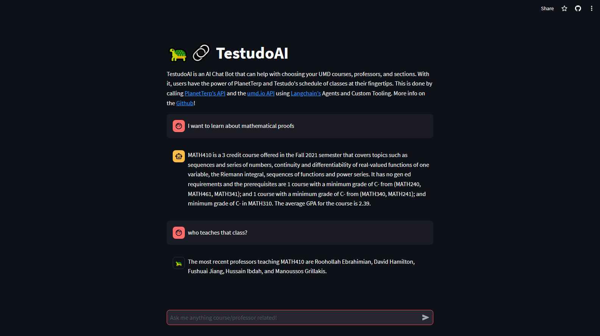

# 🐢🔗 https://testudoai.streamlit.app/

# What it does
TestudoAI is an AutoGPT App where users can ask questions about University of Maryland Courses (course descriptions, average gpa, section specific information, etc.), 
Professors (average rating on PlanetTerp, reviews, what courses they teach, etc.), grade data for courses and professors, and more! With TestudoAI, users have the 
power of PlanetTerp and Testudo at their fingertips.

# How to use it
If you have a question, just ask. TestudoAI has a familiar ChatGPT-like frontend interface. You'll need to supply your own OpenAI API key first, which you can get from 
https://platform.openai.com/account/api-keys. There are some example questions on the left to give you an idea of what you can ask.

# How it's made
TestudoAI is <strong>not</strong> a pre-trained model. It is using vanilla GPT-3.5 Turbo as the LLM (Large Language Model). So how does it know all about the University of 
Maryland's courses, sections, professors, and more? [LangChain](https://python.langchain.com/docs/get_started/introduction.html) is what makes this possible. At a basic level, 
LangChain's [MRKL](https://arxiv.org/abs/2205.00445) Agent is able to leverage custom-made tools to turn a user request into action (as in calling those tools). TestudoAI has 
8 different tools, all of which call the [umd.io](https://beta.umd.io/) and/or the [PlanetTerp](https://planetterp.com/api/) API's. Because these APIs stay up-to-date with
course seats, grade data, and professor reviews, TestudoAI is able to be dynamic in that it is providing accurate and up-to-date information where a pre-trained model could 
not. 
### Conversational Memory
Conversational Memory has been implemented with TestudoAI, meaning that it remembers past interactions as context. The result is that talking to TestudoAI has a natural 
flow of conversation without the user having to unnecessarily repeat information.
<h3 align="center">

</a>
</h3>
